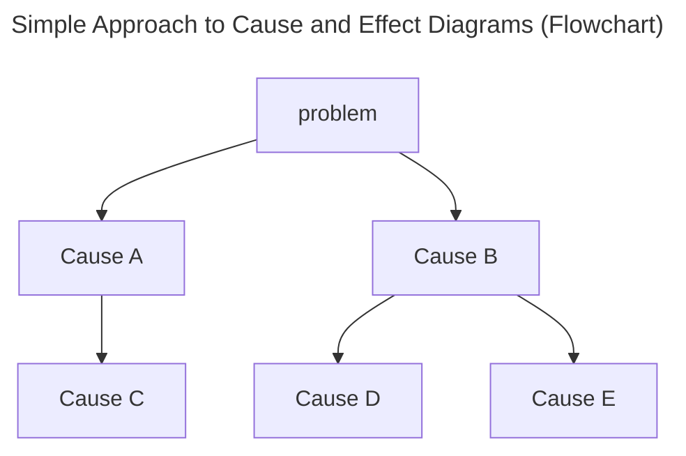
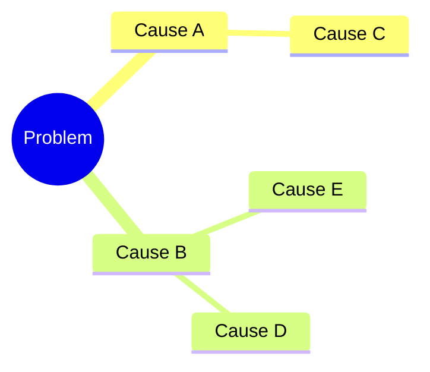
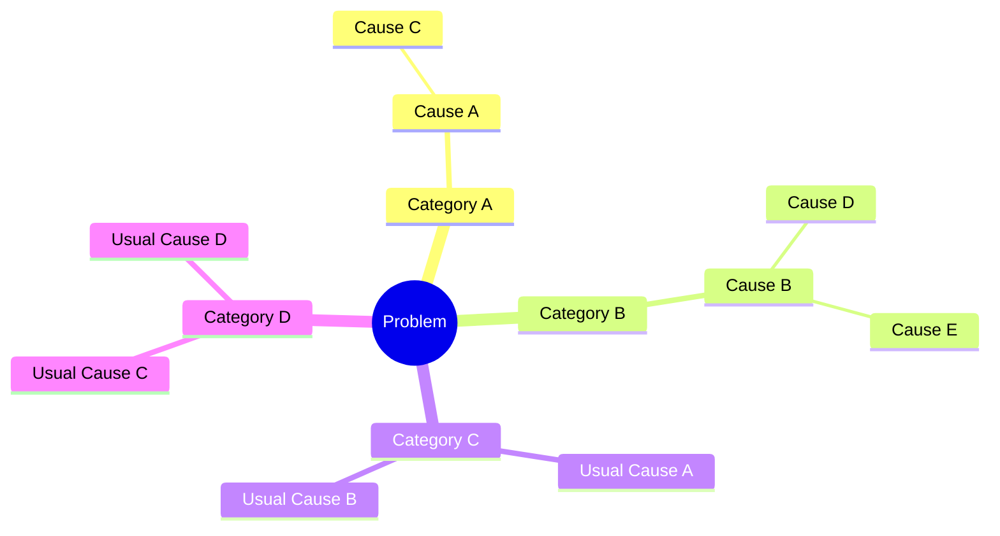
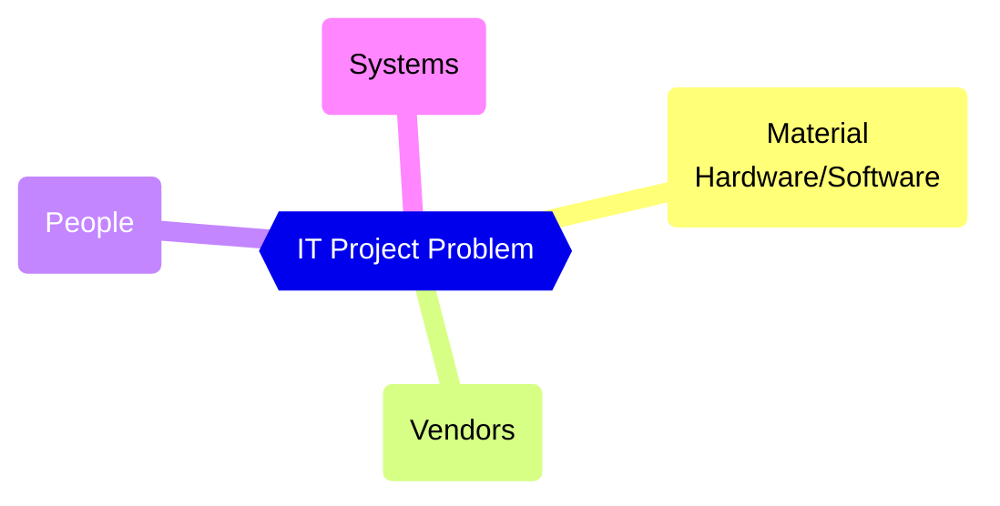
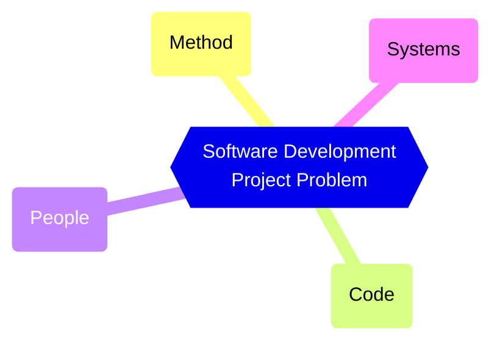
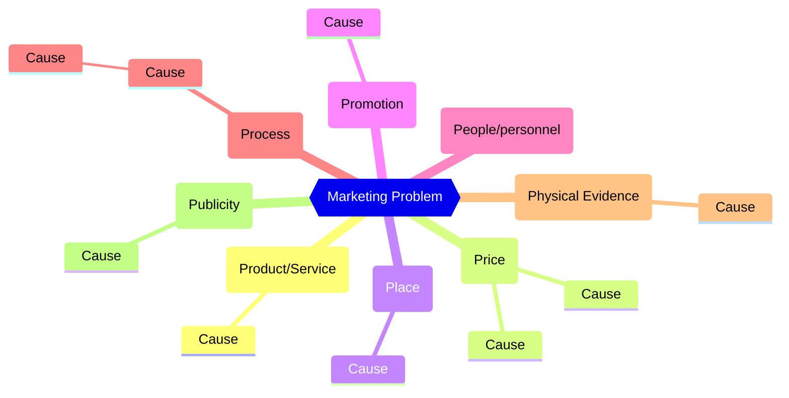
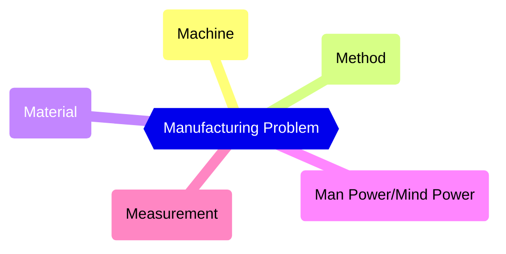
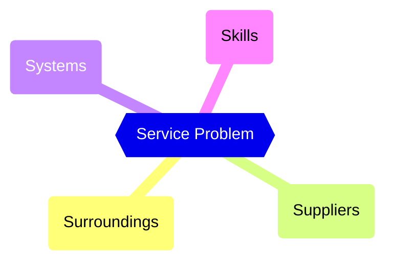
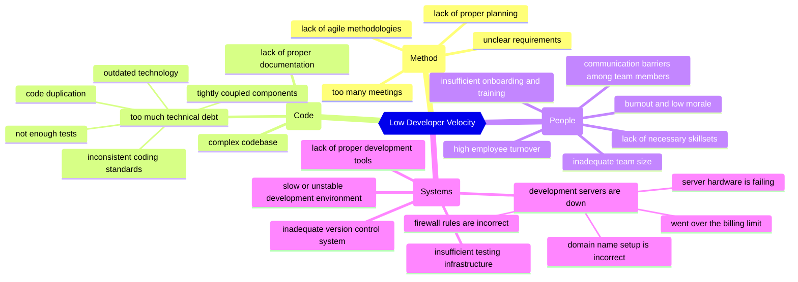
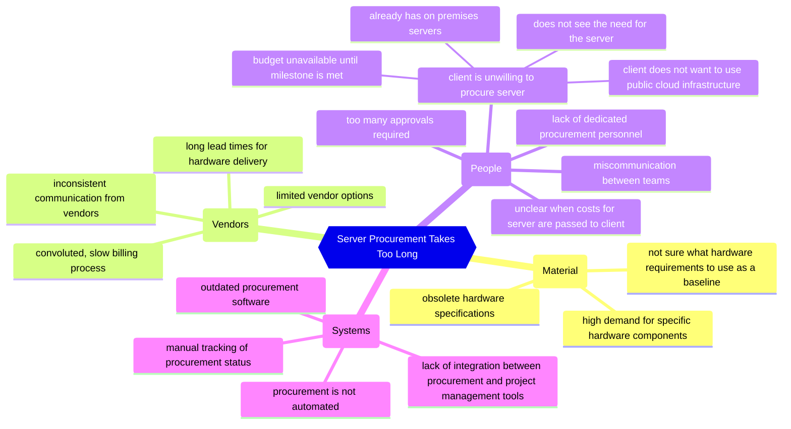

> Cause and effect diagrams are useful because they let you list out all the causes that you and/or your team can think of.
> 
> ...
> 
> Having a team think of possible causes is similar to the concept of peer review in software development projects. Where one person thinks of a few causes, another person will think of different causes. This gives a broader range of causes to investigate.
> 
> -- Rudolf Olah, ["Cause and Effect Diagrams"](https://rudolfolah.com/cause-and-effect-diagrams/)

The following are diagrams that are featured in the article ["Cause and Effect Diagrams"](https://rudolfolah.com/cause-and-effect-diagrams/).

## Simple Approach to Cause and Effect Diagrams

### Flowchart

### Mindmap

## Systemic Approach to Cause and Effect Diagrams
Systemic approach uses _categories_ and _templates_ to make finding the root cause simpler.

## MVPS: IT Project Causes

## MCPS: Software Development Project Causes

## Marketing Common Causes

## Manufacturing Common Causes

## Service Industry Common Causes

## Case Studies

### Low Developer Velocity: Causes and Effects

### Server Procurement Takes Too Long: Causes and Effects

