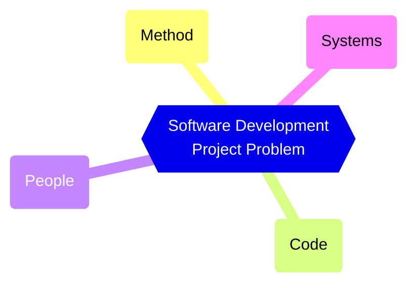
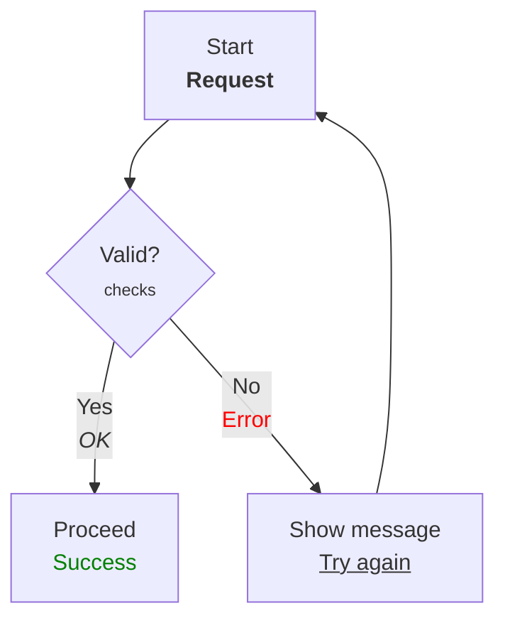

The following are diagrams that are featured in the article ["Cause and Effect Diagrams"](https://rudolfolah.com/cause-and-effect-diagrams/).

### Mindmap

## MCPS: Software Development Project Causes

