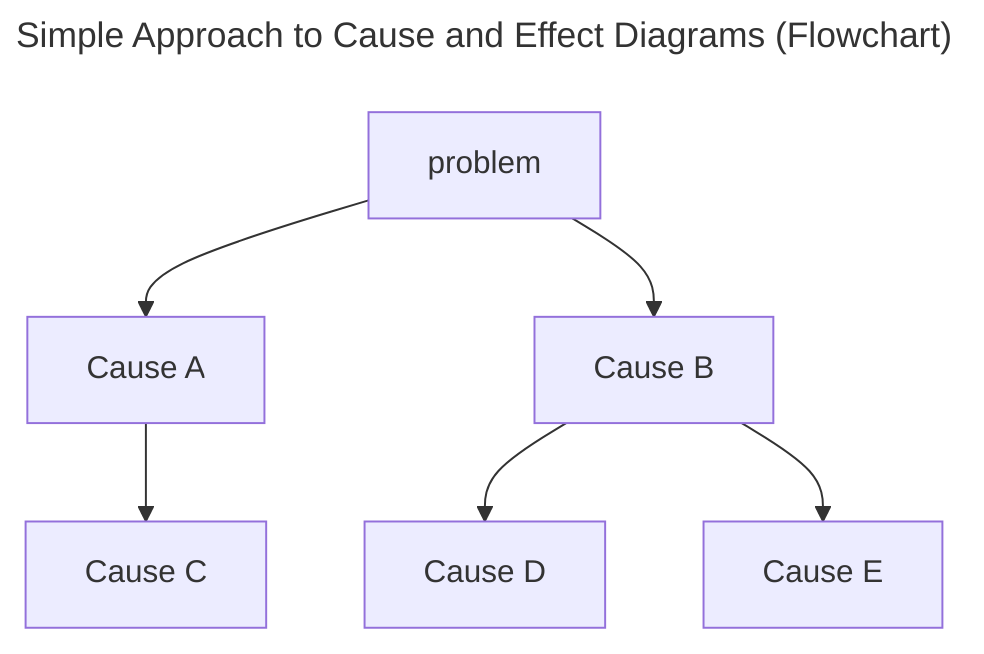
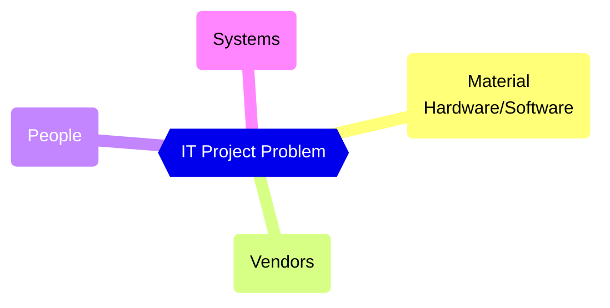
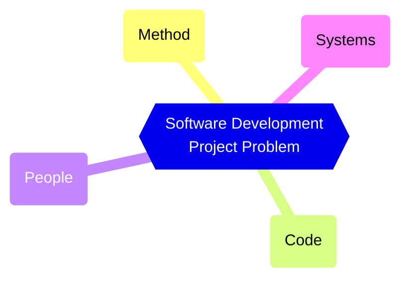

The following are diagrams that are featured in the article ["Cause and Effect Diagrams"](https://rudolfolah.com/cause-and-effect-diagrams/).

## Simple Approach to Cause and Effect Diagrams

### Flowchart

### Mindmap

## MVPS: IT Project Causes

## MCPS: Software Development Project Causes

